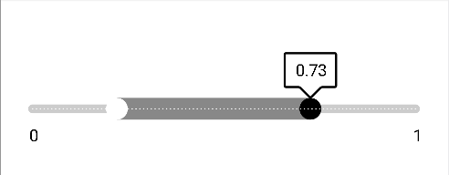

# Two Way Slider
 [](./LICENSE)

<p align="center">

</p>

This is a sample code that goes with the article on **View Customization**.

<a href="https://www.buymeacoffee.com/kuopingll" target="_blank"></a>

## Add Dependency
Inside settings.gradle
```groovy
dependencyResolutionManagement {
    repositoriesMode.set(RepositoriesMode.FAIL_ON_PROJECT_REPOS)
    repositories {
        // ...
        maven { url "https://jitpack.io" }
    }
}
```

Add dependency in app/build.gradle
```groovy
dependencies {
    // ...
    implementation 'com.github.KuoPingL:TwoWaySlider:v1.0.0'
}
```


## How to Use the Library


Simply add it in xml.

```xml
<androidx.constraintlayout.widget.ConstraintLayout xmlns:android="http://schemas.android.com/apk/res/android"
    android:id="@+id/root"
    xmlns:app="http://schemas.android.com/apk/res-auto"
    xmlns:tools="http://schemas.android.com/tools"
    android:layout_width="match_parent"
    android:layout_height="match_parent"
    tools:context=".MainActivity">

    <com.jimmy.two_way_slider.TwoWaySlider
        android:id="@+id/slider_main"
        android:layout_width="0dp"
        android:layout_height="0dp"
        app:layout_constraintTop_toTopOf="parent"
        app:layout_constraintStart_toStartOf="parent"
        app:layout_constraintEnd_toEndOf="parent"
        app:layout_constraintHeight_percent="0.3"
        android:paddingHorizontal="20dp" />
</androidx.constraintlayout.widget.ConstraintLayou>
```

You can also customize it using the following attributes :

```xml
<?xml version="1.0" encoding="utf-8"?>
<resources>

<declare-styleable name="TwoWaySlider">

    <attr name="showBottomValue" format="boolean"/>
    <attr name="showValueLabel" format="boolean"/>
    <attr name="showTick" format="boolean"/>

    <attr name="startValue" format="integer"/>
    <attr name="endValue" format="integer"/>
    <attr name="thumbFromValue" format="float"/>
    <attr name="thumbToValue" format="float"/>
    <attr name="precision" format="integer"/>
    <attr name="numberOfSteps" format="integer"/>

    <attr name="thumbToColor" format="reference|color"/>
    <attr name="thumbFromColor" format="reference|color"/>
    <attr name="thumbSize" format="dimension"/>

    <attr name="barColor" format="reference|color"/>
    <attr name="barStrokeWidth" format="dimension"/>

    <attr name="selectedRangeColor" format="reference|color"/>
    <attr name="selectedRangeStrokeWidth" format="dimension"/>

    <attr name="tickColor" format="reference|color"/>

    <attr name="fontName" format="string"/>
    <attr name="typeface" format="integer"/>
    <attr name="textColor" format="reference|color"/>
    <attr name="textSize" format="dimension"/>

    <attr name="listener" format="reference"/>

</declare-styleable>

</resources>
```
